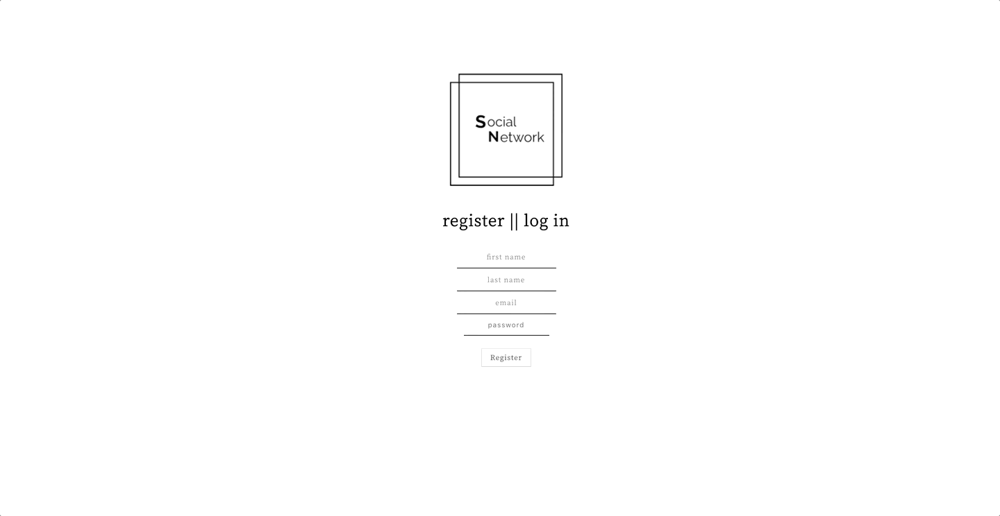

# SOCIAL NETWORK

## Overview

A single-page application website allowing users to join a social network. Features include a personal profile, image upload, list of online friends, sending, receiving, and accepting friend requests, and having conversations
in a chat room.

## Features

-   Application has a bottom navigation that allows the user to navigate to:
    -   Personal profile
    -   Page to view their list of friends (current friends as well as any existing pending friend requests)
    -   Page to view friends that are currently online
    -   Community chat room where all registered users can chat with each other
    -   Link that will enable the user to log out
-   In the personal profile, the user can upload a profile picture as well as add a small biography of themselves.
-   User can accept/reject friend requests as well as unfriend existing friends

## Technology

-   JavaScript, AWS S3, Node.js, PostgreSQL, Socket.IO, React & Redux

## Preview

**_Registration_**

 
